## BOOKBITES APP

### What is BookBites?

BookBites is a platform for book lovers to share their passion for books and connect with other
enthusiasts, basically physical books exchange and sharing platform.

#### Here's how it works:

##### Share your book:

Post the book you want to exchange, along with details such as the author, category and a short
summary on the book.

##### Receive bids:

Receive bids from fellow enthusiasts who are interested in your book, the interesting part is you
are only allowed to bid with another book.

##### Choose your preferred swap:

Review the bids and choose the one that works best for you based on the books the bidders are trying
to entice you with.  
Arrange a convenient exchange: Connect with the bidder and arrange a convenient time and place to
exchange the books and how and when to return back.

##### Unsuccessful bidders:

Unsuccessfull bidders will be added to a waiting list till the book is returned and the user marks
it available for exchange again.

## Architecture

The app is built on MVVM architecture.

## Tech Stack

### Libraries

#### UI

- [Coil](https://coil-kt.github.io/coil/)  - Load images from network source.
- [Jetpack Navigation](https://developer.android.com/guide/navigation)  - Navigations from one
  fragment to another.
- [Material design](https://m3.material.io/) - Material 3 is the latest version of Google’s
  open-source design system. Design and build beautiful, usable products with Material 3.

#### Dependency Injection

- [Hilt](https://dagger.dev/hilt/)  - Dependency Injection framework

#### Data

- [Ktor Client](https://ktor.io/docs/create-client.html) - multiplatform asynchronous HTTP client,
  whch allows you to make requests and handle responses.
- [KotlinX Serialization](https://github.com/Kotlin/kotlinx.serialization)  -
  Serialization/Desirialization of JSON response from network.
- [Datastore](https://developer.android.com/jetpack/androidx/releases/datastore) - Store
  JWT tokens for user sessions during login and registration.

## Screenshots

 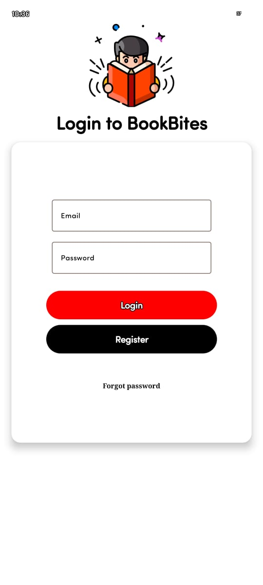 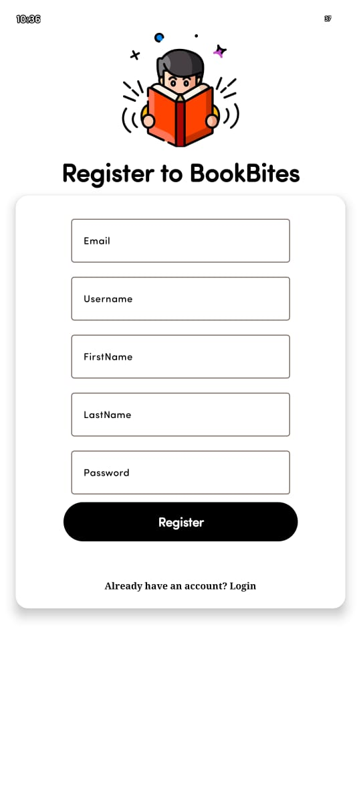
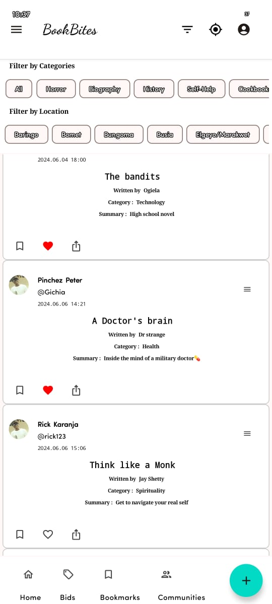 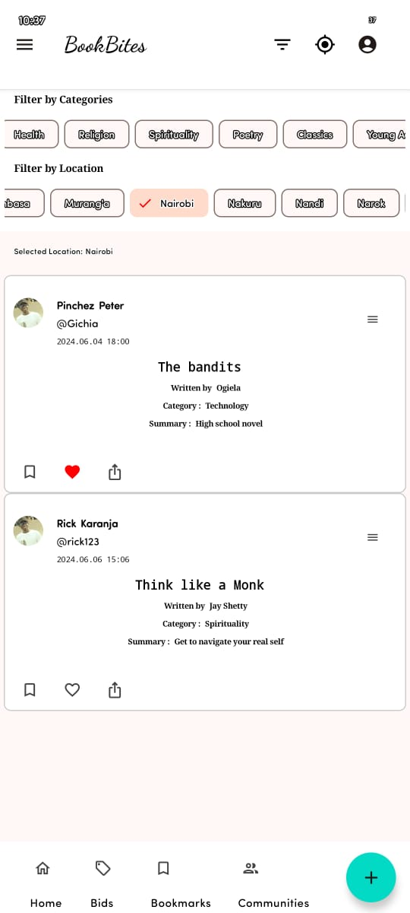 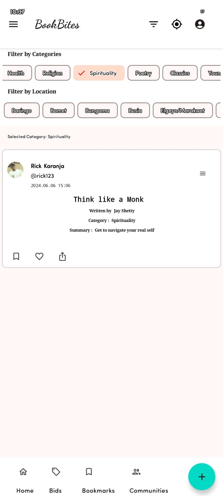
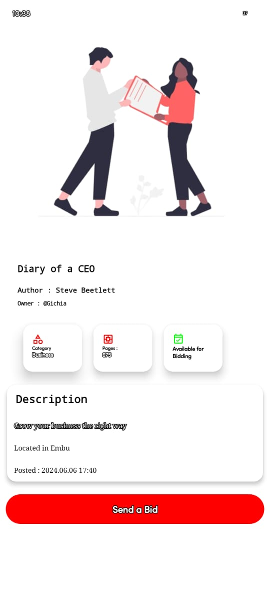 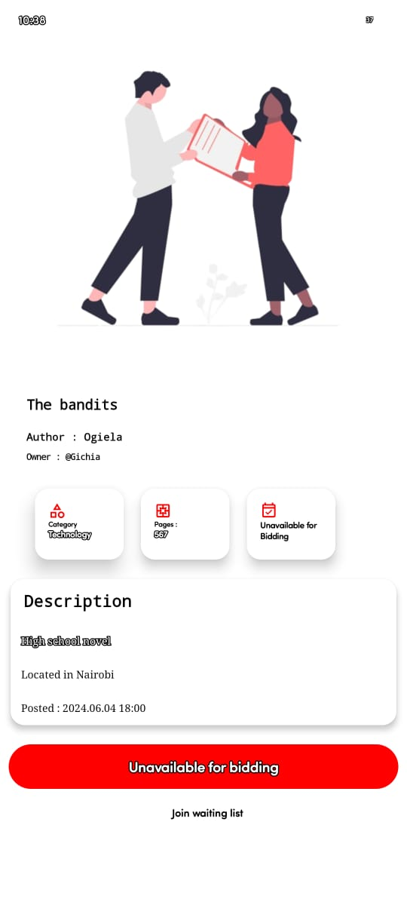 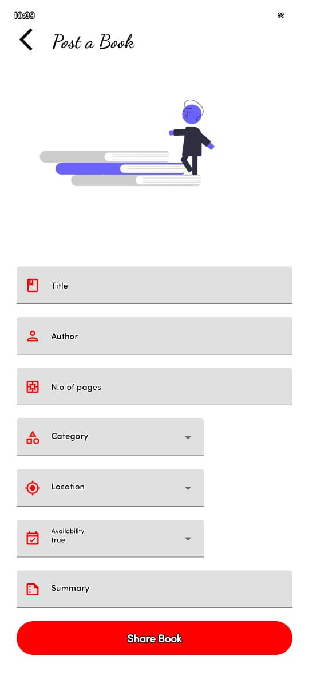
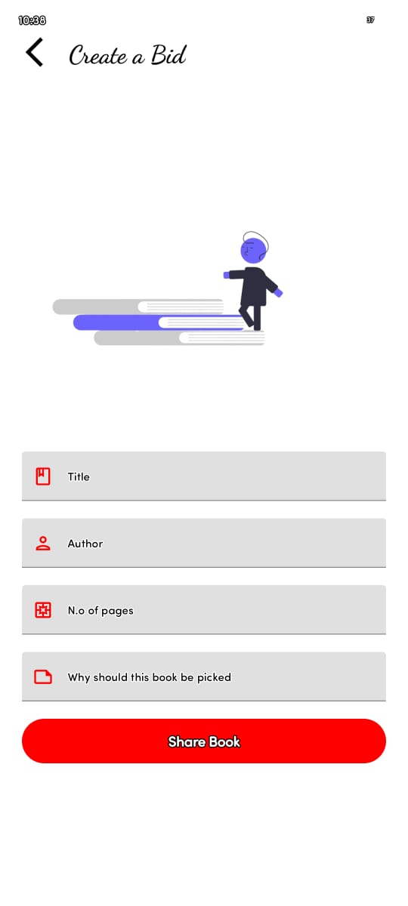 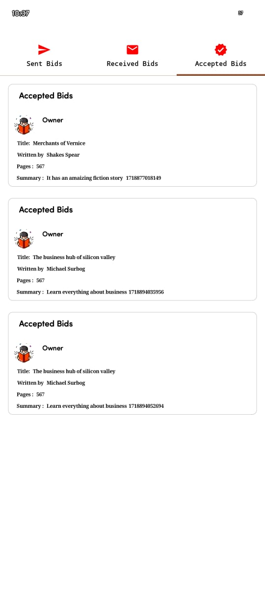 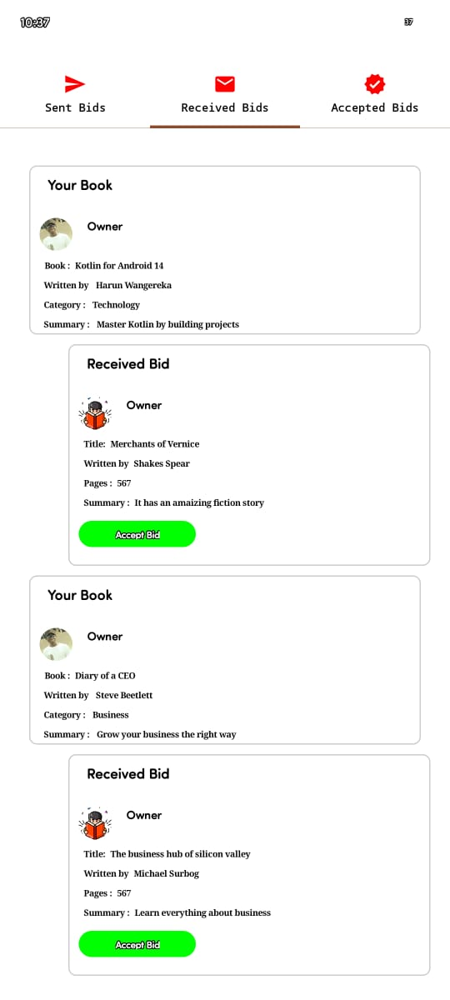
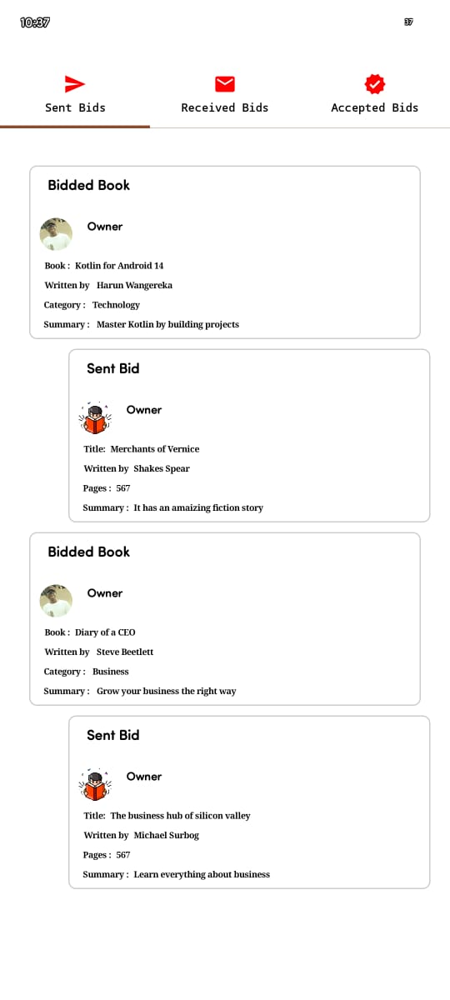 
